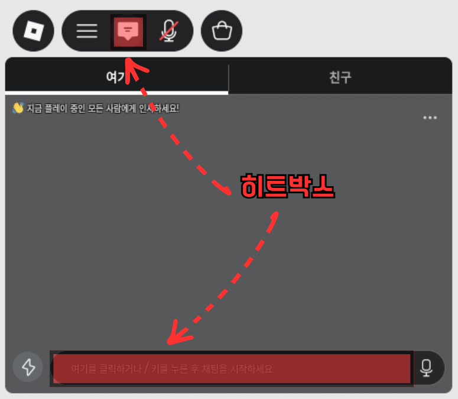

# Roblox-Korean-Chat-Fix
로블록스의 한국어 채팅 버그 수정 프로그램입니다.

# 사용법

### 1. 모니터 지정
만약 2개, 3개의 모니터를 쓰신다면 어느 모니터에서 로블록스를 하는지 지정해야합니다.
모니터는 1920*1080 해상도나 3440*1440의 모니터로 하셔야합니다.  (해상도에 따라 프로그램이 다르니 .exe 이름을 잘 보세요)

### 2. 실행
시작 버튼을 누르시면 끝입니다. 로블록스를 플레이하시면 채팅 오류가 수정됩니다.

### 3. 중지
중지 버튼을 누르거나 창을 닫으시면 프로그램이 완전히 종료됩니다.

# 주의사항

### 1. 모니터 관련
앞서 말했듯이 이 프로그램은 1920*1080 해상도나 3440*1440의 모니터에서만 작동합니다.
픽셀 위치를 바탕으로 히트박스를 구성하고 사용자가 히트박스를 클릭하거나  
/를 누르면 프로그램이 이를 감지하고 한영키를 눌러서 채팅의 시작을 한국어로 시작합니다.
  
채팅 후에 엔터를 누르면 채팅을 보낸것으로 인식하고 한영키를 눌러줍니다. 채팅을 영어로 끝냈다면 한영키를 누르지않습니다. (채팅을 다 친 후 무조건 엔터만 가능합니다. 마우스 클릭으로 버튼 눌러서 보내는건 안됩니다.)
이 모든 과정은 게임을 전체화면으로 하고 있어야만 작동하니 주의하세요.

### 2. 프로그램 관련

이 프로그램은 사용자가 로블록스를 실행했는지 판독을 할 수 없습니다. 무조건 히트박스를 그냥 게임에서 채팅창이 있는곳에 띄우기 때문에 바탕화면에서도 채팅창이 있는 위치를 클릭하면 한영키가 눌러질 수 있습니다.
반드시 체험에 들어간 후 프로그램을 켜주세요.

# 이 프로그램과 만든이에 대해

### 만든이: chyh1337
### 언어: **C++** 100%

`문의는 디스코드 chyh1337 (친추 걸면 받아요)`
